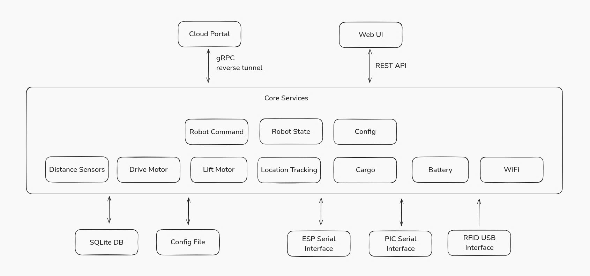

# Raybot

[](https://opensource.org/licenses/MIT)
[](https://goreportcard.com/report/github.com/tbe-team/raybot)
[](https://github.com/tbe-team/raybot/actions/workflows/go-ci.yml)
[](https://github.com/tbe-team/raybot/releases)

**Raybot** is a rail-based robotic delivery system designed for smart transportation in structured environments. It travels along a fixed overhead rail and is capable of lifting, moving, and dropping small payloads using precise control and sensor feedback.

## Features

- Configurable via yaml file
- Web UI for configuration and monitoring
- Rail-based mobility
- RFID-based location tracking
- Distance sensors for obstacle detection
- Dual-motor control: movement + lifter
- UART communication with embedded boards
- Wifi AP, Station mode
- gRPC API for remote control and monitoring
- Reverse gRPC tunnel for cloud integration

## Technologies and frameworks

- Go 1.24
- gRPC
- Protobuf
- SQLite
- Vue.js
- Shadcn Vue
- TailwindCSS

## Architecture



## Getting started

1. Prerequisites

- Go 1.24
- Node.js 22

2. Clone the repository

```bash
git clone https://github.com/tbe-team/raybot.git
```

3. Install dependencies

```bash
go mod tidy
```

4. Run

```bash
cp config/config.yml bin/config.yml
touch bin/raybot.db

# Run the project
make run
```

## Development

See [DEVELOPMENT.md](DEVELOPMENT.md) for details.

## Contributing

Please read [CONTRIBUTING.md](CONTRIBUTING.md) for details on our code of conduct, and the process for submitting pull requests to us.

## License

This project is licensed under the MIT License - see the [LICENSE](LICENSE) file for details.
